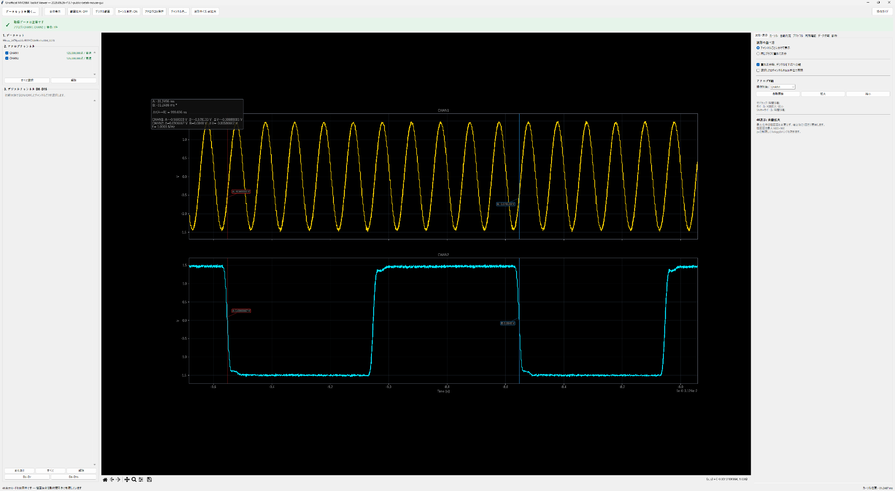

# Unofficial MHO984 Compatibility Toolkit v0.1.0-beta.9

An independent, unofficial Windows toolkit for interoperability with the RIGOL MHO984. The acquisition engine is r12.11e and the Viewer is r13.5. Normal workflows are now launched from one main window.

> This project is not an official RIGOL product and is not affiliated with, endorsed by, or warranted by RIGOL Technologies Co., Ltd. RIGOL and product names belong to their respective owners and are used only to identify the interoperability target.

## Screenshot

*Viewer example showing Analog waveforms, channel controls, protocol overlays, zoom/pan, and measurement cursors in one window.*

**Download the latest beta:** [GitHub Releases](https://github.com/ojimay0123-netizen/Unofficial-MHO984-Compatibility-Toolkit/releases)

## Installation and verification

1. Follow [Installation](docs/INSTALLATION.md) (English quick start included): verify the named release ZIP checksum, prepare Python/Tkinter, run setup_venv.bat, then start the toolkit and configure the scope IP.
2. Use [Hardware validation](docs/HARDWARE_VALIDATION.md) for analog, D0–D15, alignment, SINGLE timeout, and beta.9 deep-memory acquisition checks.
3. Consult [Troubleshooting](docs/TROUBLESHOOTING.md) and [Known limitations](docs/KNOWN_LIMITATIONS.md).

SCPI defaults to TCP 5555; FTP control uses TCP 21 plus a data connection. Exact validated Windows/Python/package combinations still need to be recorded. Documentation updates on main do not automatically replace published tags or Release ZIPs.

## Start here

Normal users should launch only **`START_MHO984_Toolkit.bat`**. If NumPy/Matplotlib are unavailable, use `Tools -> Set up Python environment` or run `setup_venv.bat`. Direct component launchers are kept under `advanced_launchers/` for troubleshooting.

## Main window

- **Acquire from oscilloscope**: SINGLE -> STOP -> save Memory BIN to scope C:/ -> anonymous FTP/21 -> decode -> Viewer.
- **Open saved BIN**: select an MHO984 Memory waveform BIN, decode it locally with no scope/LAN access, create an `mho984_offline_*` dataset, then open Viewer.
- **Open existing dataset**: open an already decoded dataset in Viewer.
- **Protocol analysis**: decode UART, RS-232, RS-485, I2C, SPI, LIN, Classic CAN, GPS NMEA/UBX and PPS from captured Analog/Digital signals.
- **Settings -> Connection and storage**: set the MHO984 IPv4 address and PC storage folder.

The offline BIN workflow can only recover channels that were actually present in the saved Memory BIN. If the LA record was not captured, D0-D15 cannot be reconstructed later.

## Supported status

- **MHO984: validated on real hardware**
- MHO934/MHO954: not validated; online acquisition rejects non-MHO984 instruments via `*IDN?`.
- RG03 internals, LA lower16 decoding and anonymous FTP behavior are empirical compatibility implementations, not documented SCPI guarantees.

## Safety / legal

Read `LEGAL_NOTICE.md`, `SECURITY.md`, `PRIVACY.md`, `SOURCE_PROVENANCE.md` and `LICENSE` before redistribution or use. Anonymous FTP is unencrypted and should only be used on an authorized trusted LAN. Offline BIN decoding does not use the network.

The bundled +2.091228967 ppm digital timebase value is an empirical relative-alignment reference from one tested MHO984, not a universal or traceable calibration. Viewer defaults to Raw.

## Release status

`v0.1.0-beta.9` is an **MHO984 validated / community testing beta**. beta.9 adds firmware-save compatibility and capacity-aware dynamic FTP SIZE waiting for large Memory BIN captures; successful acquisition has been reported on a RIGOL loaner/demo MHO984 with the 500 Mpts storage depth option. Protocol results are convenience analysis only and are not conformance certification. CAN FD is not implemented.

## beta.5: Viewer protocol bands

Decoded protocol events can be overlaid directly on the original Viewer waveforms. Auto-publish after decode is enabled by default. The Viewer's Protocol Band tab controls visibility, opacity, label density, reload and clear. Event classes are color-coded and decode errors are shown in red. Waveform BIN files are never modified by the overlay feature.

## beta.6: Viewer GUI and mouse interaction

- Viewer detail tabs are reordered around the common workflow.
- Hover within about 8 pixels of an A-Z measurement cursor to get a horizontal-resize pointer; left-drag the line to move that cursor directly.
- Right-drag in the waveform area pans the shared time axis and changes the mouse pointer while dragging.
- Existing wheel zoom, Shift+wheel pan, keyboard cursor selection and sample stepping are preserved.

### beta.9: capacity-aware deep-memory FTP wait

- Removes the fixed 60-second stable-SIZE deadline for a file that is still growing.
- Uses RG03 header size only as an observation-budget hint, never as the completion target.
- Tracks observed FTP SIZE growth and extends the soft deadline when needed.
- Keeps a 600-second hard maximum.
- Requires six stable SIZE polls, exact local/remote byte equality, and RG03 decoder validation.
- Hardware acquisition was reported successful on a RIGOL loaner/demo MHO984 with the 500 Mpts storage depth option.

### beta.7: SINGLE timeout handling

When acquisition is started from `START_MHO984_Toolkit.bat`, a SINGLE trigger timeout no longer immediately terminates the run. The local dialog offers one-time Force Trigger, another wait interval, or abort. Headless operation remains fail-safe. The timeout interval is configurable in Settings.

